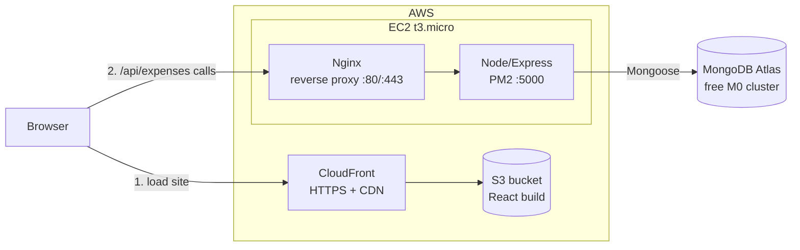
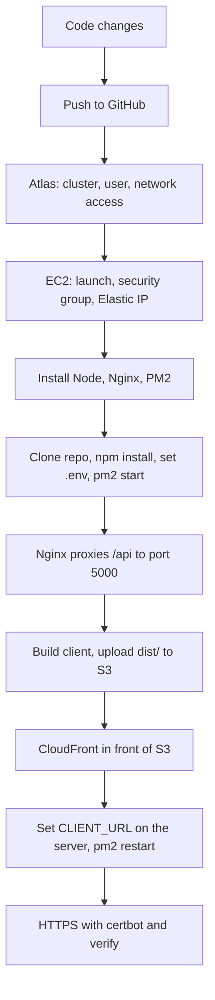

# Expense Tracker: AWS Deployment Plan

## Architecture



The same layout as plain text:

```
                +--------------------+        +-------------------+
   Browser ---> | CloudFront (HTTPS) | -----> | S3: React build   |
      |         +--------------------+        +-------------------+
      |
      |  API calls (/api/expenses)
      v
+--------------------------------------+
| EC2 (t3.micro, Ubuntu)               |
|  Nginx :80/:443 --> Node/Express     |        +----------------------+
|                     (PM2, port 5000) | -----> | MongoDB Atlas (M0)   |
+--------------------------------------+        +----------------------+
```

| Layer | Service | Why |
|---|---|---|
| Frontend | S3 + CloudFront | Cheap static hosting with HTTPS |
| Backend | EC2 + Nginx + PM2 | Simple, full control, free tier eligible |
| Database | MongoDB Atlas (M0) | Managed and free, no Mongo to maintain on AWS |

## Deployment flow



## Step 0: Code changes before deploying

1. **Frontend API URL.** `client/src/App.jsx` hardcodes `http://localhost:5000/api/expenses`. Change it to:
   ```js
   const API = import.meta.env.VITE_API_URL || 'http://localhost:5000/api/expenses'
   ```
   Add `client/.env.production`:
   ```
   VITE_API_URL=https://your-api-domain/api/expenses
   ```
2. **CORS.** In `server/server.js`, replace `cors()` with `cors({ origin: process.env.CLIENT_URL })`.
3. **`.gitignore`** in both folders for `node_modules` and `.env`. Never commit secrets.
4. **Start script.** Add `"start": "node server.js"` to `server/package.json`.
5. **Git.** Push the project to a GitHub repository.

## Step 1: Database (MongoDB Atlas)

1. Create a free M0 cluster at mongodb.com/atlas.
2. Create a database user with a password.
3. Network Access: allow the EC2 Elastic IP.
4. Copy the connection string and add `/expenses` as the database name.

## Step 2: Backend on EC2

1. Launch an Ubuntu 22.04 t3.micro instance and create a key pair (`.pem`).
2. Security group inbound rules: SSH (22) from your IP only, HTTP (80) and HTTPS (443) from anywhere.
3. Allocate an Elastic IP and attach it to the instance.
4. SSH in: `ssh -i key.pem ubuntu@<elastic-ip>`
5. Install the tools:
   ```
   curl -fsSL https://deb.nodesource.com/setup_20.x | sudo -E bash -
   sudo apt install -y nodejs nginx git
   sudo npm i -g pm2
   ```
6. Deploy the code:
   ```
   git clone <your-repo> && cd <repo>/server
   npm install --omit=dev
   nano .env
   pm2 start server.js --name expense-api
   pm2 save && pm2 startup
   ```
   `.env` contents:
   ```
   PORT=5000
   MONGO_URI=<atlas connection string>
   CLIENT_URL=<CloudFront URL>
   ```
7. Nginx reverse proxy. Create `/etc/nginx/sites-available/expense`:
   ```
   server {
     listen 80;
     server_name _;
     location /api/ {
       proxy_pass http://localhost:5000;
     }
   }
   ```
   Enable and reload:
   ```
   sudo ln -s /etc/nginx/sites-available/expense /etc/nginx/sites-enabled/
   sudo nginx -t && sudo systemctl restart nginx
   ```
8. Test: `curl http://<elastic-ip>/api/expenses` should return `[]`.

## Step 3: Frontend on S3 + CloudFront

1. Build: `cd client && npm run build`. This creates `dist/`.
2. Create an S3 bucket and upload the contents of `dist/`.
3. Create a CloudFront distribution with the bucket as origin, using Origin Access Control. Set the default root object to `index.html`.
4. Add a custom error response that maps 403 and 404 to `/index.html`, so page refreshes work.
5. Put the CloudFront URL in the backend `.env` as `CLIENT_URL`, then run `pm2 restart expense-api`.

## Step 4: HTTPS

- The frontend gets HTTPS from CloudFront (ACM certificate if you use a custom domain, via Route 53).
- The API also needs HTTPS, or browsers block the calls as mixed content. Point a subdomain (for example `api.yourdomain.com`) at the Elastic IP and run `sudo certbot --nginx`.

## Step 5: Verify

- Open the site, then add, filter and delete expenses and check the summary.
- Backend logs: `pm2 logs expense-api`
- Browser DevTools, Network tab, for CORS errors.

## Common problems

| Symptom | Cause |
|---|---|
| Frontend loads but no data | Wrong `VITE_API_URL`. It is baked in at build time, so rebuild. |
| CORS error | `CLIENT_URL` doesn't exactly match the frontend origin (no trailing slash). |
| DB connection error | Atlas network access is missing the EC2 IP. |
| Connection timeout | Security group is missing port 80 or 443. |
| Refresh gives 403/404 | CloudFront custom error response for `/index.html` is missing. |

## Cost

The free tier covers EC2 t3.micro (750 hours a month for 12 months), S3, and Atlas M0, so roughly $0. An Elastic IP is charged when it is not attached to a running instance.
