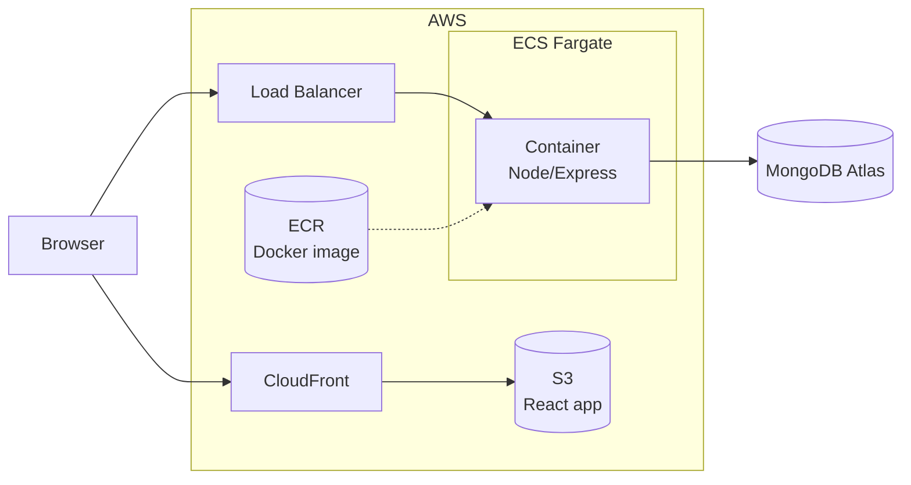
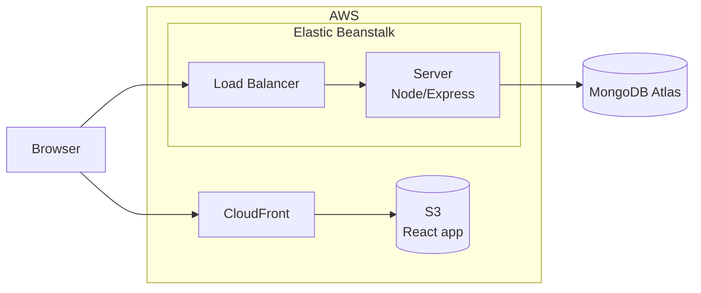

# Expense Tracker: AWS Deployment Plan

The whole app is hosted on AWS. There are two ways to host the backend. The frontend and database are the same in both.

- **Frontend:** the React app, hosted on S3 and served through CloudFront.
- **Database:** MongoDB Atlas, created in an AWS region.
- **Backend:** the Node/Express API. Hosted either as a container (Plan 1) or directly (Plan 2).

---

## Plan 1: Container

The backend is packed into a Docker image, stored in ECR, and run on ECS Fargate.

**In short**
1. Build the Docker image of the backend.
2. Push it to ECR.
3. Run it on ECS Fargate behind a load balancer.
4. Upload the React build to S3 and put CloudFront in front.

---

## Plan 2: Direct hosting

The backend code is uploaded as it is to Elastic Beanstalk, with no Docker.

**In short**
1. Upload the backend code to Elastic Beanstalk.
2. Add the database connection string as an environment variable.
3. Upload the React build to S3 and put CloudFront in front.

---

## Which one?

| | Plan 1: Container | Plan 2: Direct |
|---|---|---|
| Backend runs on | ECS Fargate | Elastic Beanstalk |
| Packaged as | Docker image | Plain code |
| Best for | Same setup everywhere | Quickest to set up |
