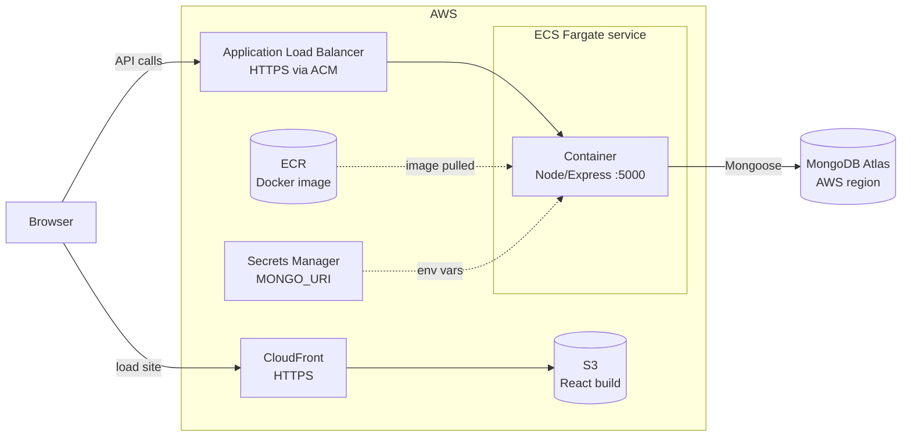
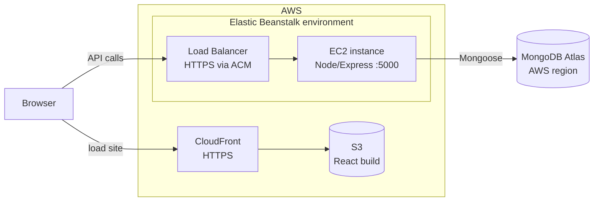

# Expense Tracker: AWS Deployment Plan

Everything is hosted on AWS. There are two plans for the backend: run it as a **container** (Plan 1) or deploy the Node code **directly** without containers (Plan 2). The frontend and database are the same in both.

| Layer | Service (both plans) |
|---|---|
| Frontend | S3 + CloudFront  |
| Database | MongoDB Atlas, created in an AWS region |

| | Plan 1: Container | Plan 2: Direct |
|---|---|---|
| Backend runs on | ECS Fargate | Elastic Beanstalk (Node.js) |
| How it is packaged | Docker image in ECR | Zip of the `server/` folder |
| Servers to manage | None | None (managed by Beanstalk) |
| Best for | Same setup everywhere, easy to scale | Fastest and simplest to deploy |

---

## Architecture

### Plan 1: Containerized (ECR + ECS Fargate)



### Plan 2: Direct hosting (Elastic Beanstalk)



---

## Step 0: Code changes (both plans)

1. **Frontend API URL.** `client/src/App.jsx` hardcodes `http://localhost:5000/api/expenses`. Change it to:
   ```js
   const API = import.meta.env.VITE_API_URL || 'http://localhost:5000/api/expenses'
   ```
   Add `client/.env.production`:
   ```
   VITE_API_URL=https://api.yourdomain.com/api/expenses
   ```
2. **CORS.** In `server/server.js`, replace `cors()` with `cors({ origin: process.env.CLIENT_URL })`.
3. **`.gitignore`** in both folders for `node_modules` and `.env`. Never commit secrets.
4. **Start script.** Add `"start": "node server.js"` to `server/package.json`.
5. **Health check.** Both plans check the backend's health on a path. `/api/expenses` already returns 200, so use that.

## Step 1: Database (both plans)

1. Create a free M0 cluster at mongodb.com/atlas and choose an **AWS region** (the same region as your backend).
2. Create a database user with a strong password.
3. Copy the connection string and add `/expenses` as the database name.
4. Network Access: the backend's outgoing IP has to be allowed. See the note under each plan.

## Step 2: Frontend on S3 + CloudFront (both plans)

1. Build: `cd client && npm run build`. This creates `dist/`.
2. Create an S3 bucket (keep it private) and upload the contents of `dist/`.
3. Create a CloudFront distribution with the bucket as origin, using Origin Access Control. Set the default root object to `index.html`.
4. Add a custom error response that maps 403 and 404 to `/index.html`, so page refreshes work.
5. Note the CloudFront URL. It becomes `CLIENT_URL` in the backend.

---

## Plan 1: Containerized backend (ECR + ECS Fargate)

### 1. Containerize

`server/Dockerfile`:
```
FROM node:20-alpine
WORKDIR /app
COPY package*.json ./
RUN npm ci --omit=dev
COPY . .
EXPOSE 5000
CMD ["node", "server.js"]
```

`server/.dockerignore`:
```
node_modules
.env
```

Build locally to check it works:
```
docker build -t expense-api ./server
```

### 2. Push the image to ECR

```
aws ecr create-repository --repository-name expense-api
aws ecr get-login-password --region <region> | docker login --username AWS --password-stdin <account-id>.dkr.ecr.<region>.amazonaws.com
docker tag expense-api:latest <account-id>.dkr.ecr.<region>.amazonaws.com/expense-api:latest
docker push <account-id>.dkr.ecr.<region>.amazonaws.com/expense-api:latest
```

### 3. Store the secret

Create a Secrets Manager secret holding `MONGO_URI`. Never bake it into the image.

### 4. Run it on ECS Fargate

1. Create an ECS cluster (Fargate).
2. Create a task definition: 0.25 vCPU and 0.5 GB memory, the ECR image, container port 5000. Environment: `PORT=5000` and `CLIENT_URL=<CloudFront URL>`. Add `MONGO_URI` from Secrets Manager.
3. Create an Application Load Balancer with a target group on port 5000. Set the health check path to `/api/expenses`.
4. Create an ECS service from the task definition, attached to the load balancer. Start with 1 task.
5. Security groups:
   - Load balancer: allow 80 and 443 from anywhere.
   - Container: allow 5000 **only from the load balancer's security group**.

### 5. HTTPS

Request a free certificate in ACM for `api.yourdomain.com`, add an HTTPS (443) listener on the load balancer, and point the domain at it with a Route 53 alias record.

### 6. Atlas access

Fargate tasks in public subnets get a changing public IP. Choose one:
- **Demo:** allow `0.0.0.0/0` in Atlas and rely on a strong database password.
- **Production:** run the tasks in private subnets behind a NAT Gateway with an Elastic IP and allow only that IP. The NAT Gateway costs roughly $32 a month.

### 7. Update flow

Rebuild, push the new image, then force a new deployment:
```
aws ecs update-service --cluster <cluster> --service <service> --force-new-deployment
```

---

## Plan 2: Direct hosting (Elastic Beanstalk)

No Docker. You upload the Node app and Beanstalk creates the EC2 instance, load balancer and health monitoring.

### 1. Prepare

Make sure `server/package.json` has `"start": "node server.js"`. Beanstalk runs `npm install` and `npm start` for you. Do not include `node_modules` or `.env`.

### 2. Create the environment

With the EB CLI:
```
cd server
eb init expense-api --platform node.js --region <region>
eb create expense-env --elb-type application
```
Or use the console: Elastic Beanstalk, Create application, Web server environment, Node.js platform, upload a zip of the `server/` folder.

### 3. Set environment variables

```
eb setenv PORT=8080 MONGO_URI="<atlas connection string>" CLIENT_URL="<CloudFront URL>"
```
Beanstalk's Node.js platform forwards traffic to port 8080 by default. If you keep `PORT=5000`, set the same value in the environment's software settings instead of overriding it.

### 4. Health check

In the environment's load balancer settings, set the health check path to `/api/expenses`.

### 5. HTTPS

Request a certificate in ACM for `api.yourdomain.com`, add an HTTPS (443) listener to the environment's load balancer, and point the domain at it with a Route 53 alias record.

### 6. Atlas access

Find the instance's public IP and allow it in Atlas. It changes if the instance is replaced, so for a demo either allow `0.0.0.0/0` with a strong password, or put the environment in a VPC with a NAT Gateway and Elastic IP.

### 7. Update flow

```
cd server
eb deploy
```

---

## Verify (both plans)

1. `curl https://api.yourdomain.com/api/expenses` should return `[]`.
2. Open the CloudFront URL and add, filter and delete expenses. Check that the summary updates.
3. Logs: CloudWatch Logs (Plan 1), or `eb logs` (Plan 2).
4. Browser DevTools, Network tab, for CORS errors.

## Common problems

| Symptom | Cause |
|---|---|
| Frontend loads but no data | Wrong `VITE_API_URL`. It is baked in at build time, so rebuild and re-upload. |
| CORS error | `CLIENT_URL` doesn't exactly match the CloudFront origin (no trailing slash). |
| Mixed content blocked | The API is on HTTP. Add the ACM certificate and the 443 listener. |
| DB connection error | The backend's IP isn't allowed in Atlas network access. |
| Targets unhealthy (Plan 1) | Health check path or port is wrong, or the container security group blocks the load balancer. |
| Task keeps restarting (Plan 1) | Missing `MONGO_URI`. Check the CloudWatch logs. |
| Environment health is red (Plan 2) | The app isn't listening on the port Beanstalk expects. Check `PORT`. |
| Refresh gives 403/404 | The CloudFront custom error response for `/index.html` is missing. |

## Cost (rough)

| Item | Plan 1 | Plan 2 |
|---|---|---|
| Compute | Fargate 0.25 vCPU, about $9 a month | EC2 t3.micro, free tier for 12 months |
| Load balancer | About $16 a month | About $16 a month |
| NAT Gateway (optional) | About $32 a month | About $32 a month |
| S3 + CloudFront | Pennies at this scale | Pennies at this scale |
| Atlas M0 | Free | Free |

The Application Load Balancer is the main cost in both plans. Delete the environment or service when you finish practicing.
